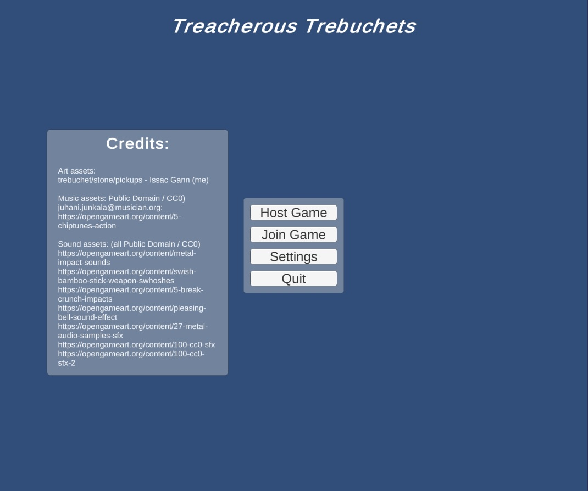

# Treacherous Trebuchets
Treacherous Trebuchets is a small network-multiplayer PvP game I made as my final project for a game design class.

As part of the project, I had to choose a theme from a few given options, 2 features from one pool of features, and 1 feature from another pool of features. I chose the theme "We usually skip this", Skeletal Animation and Sound from Pool A, and Multiplayer from Pool B.

## Screenshots

Figure 1. The main menu where you can host games, join games, or adjust settings.

Figure 2. The green pad makes the player bounce.

Figure 3. Two players fight.

Figure 4. There are 3 different game modes.

# Project Information
Issac Gann (no team)

Pool A: Skeletal Animation & Sound
Pool B: Multiplayer

## Theme
We usually skip this. We usually skip stones, but in this game, we use stones to kill each other.

## Challenges/Goals
Killing other players. There are 3 gamemodes: get the most kills under 10 minutes, first to get 50 kills wins, and battle royale.
Aiming the stones.
Managing health and ammunition.
Navigating level 1 and level 2.

## Controls
- <- or A: Left
- -> or D: Right
- Left Mouse Button: shoot stone.

## Assets

### Art assets
trebuchet/stone/pickups - Issac Gann (me)

### Sound assets: (all Public Domain / CC0)
- https://opengameart.org/content/metal-impact-sounds
- https://opengameart.org/content/swish-bamboo-stick-weapon-swhoshes
- https://opengameart.org/content/5-break-crunch-impacts
- https://opengameart.org/content/pleasing-bell-sound-effect
- https://opengameart.org/content/27-metal-audio-samples-sfx
- https://opengameart.org/content/100-cc0-sfx
- https://opengameart.org/content/100-cc0-sfx-2

Music assets: (all Public Domain / CC0)
- juhani.junkala@musician.org: https://opengameart.org/content/5-chiptunes-action

## Implementation Details
For multiplayer, the game uses Unity's Netcode for GameObjects mid-level networking library and a client-host connection system. Skeletal animation was done with Unity's 2D skeletal animation tools, and sound effects/music were implemented with a custom singleton class along with the Unity Audio Mixer tools.

## Notes
If running in the editor, make sure the game starts on the NetworkManagerScene so that it can load the network manager and some other singletons.

There are some features that I originally planned for that went unimplemented, such as color swapping and internet connectivity, so the UI elements for them are still there, but disabled.
